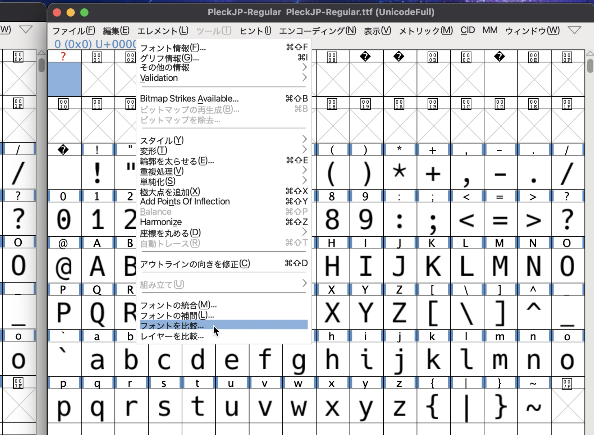
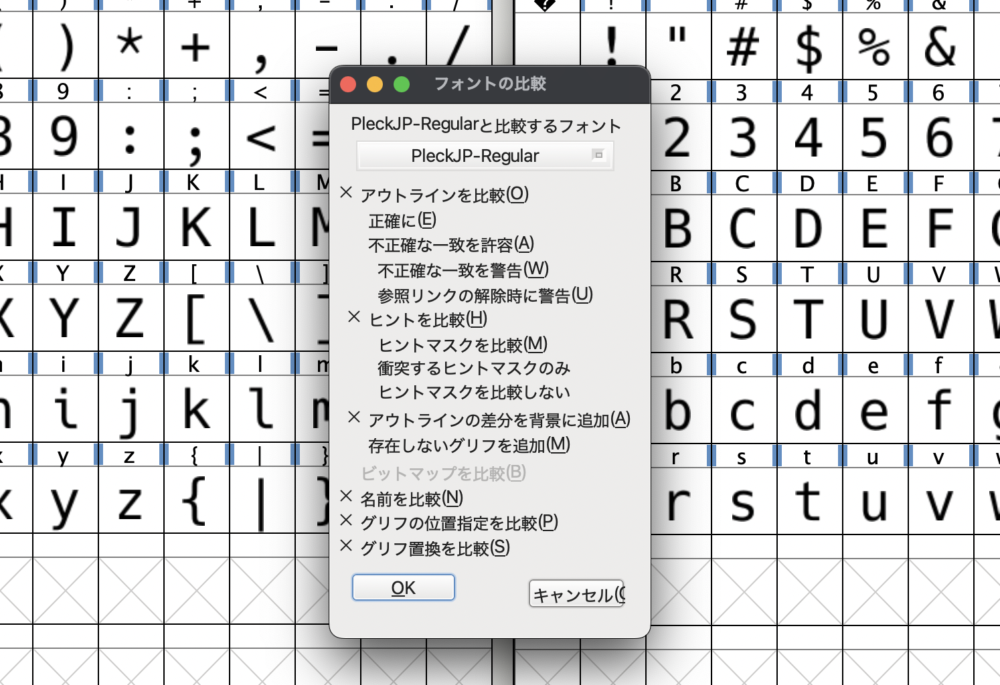
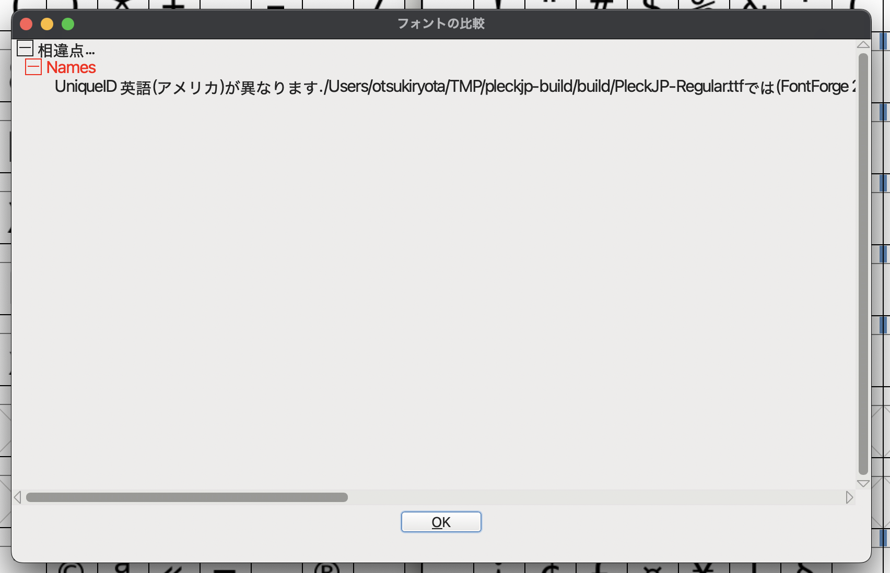

# ビルド方法

最も手軽な方法は [README.md](./README.md) 記載の通り `make` コマンドを実行することです。
このリポジトリを取得するところから含めるならば次のようになるでしょう。

```console
$ git clone https://github.com/ryota2357/PleckJP.git
$ cd PleckJP
$ make
$ ls ./build
PleckJP-Bold.ttf  PleckJP-BoldItalic.ttf  PleckJP-Italic.ttf  PleckJP-Regular.ttf
```

`make` には時間がかかるので、適宜 `-j` オプションで並列化すると良いと思います。

## 再現性を高める

上記の手軽な方法は、このリポジトリの HEAD にて新たに docker container を作成し、その環境でビルドを行います。
そのため、フォントの合成・編集に使用している FontForge のバージョンや、そのほか Python 等のバージョンなどがリリースビルドで使用したものと異なる可能性があります。

これを解決するため、v1.4.0 より Docker Hub にリリースビルドで使用したコンテナのイメージを公開するようにしました。

以下その Docker image の使用方法を説明します。なお、`$varsion` は `1.4.0` など、実際に使用したいバージョンに置き換えてください。

### ビルド手順

まず、リリースに使用した環境に入ります。

ビルド成果物はコンテナ内の `/home/pleckjp/build` に作成されるため、適当なディレクトリでマウントするようにしてください。
以下の例では、`$(pwd)/build` をマウントします。

```console
$ docker run -it --rm -v "$(pwd)"/build:/home/pleckjp/build ryota2357/pleckjp:$version

root@5f8aca8514f5:/home/pleckjp# ls
LICENSE  Makefile  README.md  build  resources  src
```

`ls` コマンドの内容は `$version` により異なる可能性があります。

続いて、`make` を実行して、ビルド手順を確認してください。

```console
root@5f8aca8514f5:/home/pleckjp# make
Running inside Docker container
Please run:
  make with-fontforge
  make with-fonttools
```

内容は `$version` により異なる可能性があります。ここでは、上記の出力に従います。

`make ..` は基本的に時間がかかるので、適宜 `-j` オプションで並列化してください。この例では `-j4` としています。

```console
root@5f8aca8514f5:/home/pleckjp# make -j4 with-fontforge
...ここにビルドログが色々出る

root@5f8aca8514f5:/home/pleckjp# make -j4 with-fonttools
...ここにビルドログが色々出る
```

以上でビルドは終了です。`exit` 等でコンテナから抜けてください。

```console
root@5f8aca8514f5:/home/pleckjp# exit

$ ls build
PleckJP-Bold.ttf        PleckJP-BoldItalic.ttf  PleckJP-Italic.ttf      PleckJP-Regular.ttf
```

このように ttf ファイルを入手することができているはずです。

### 成果物の検証

ビルドされたものが GitHub のリリースページに上がっているのものと同じ内容か確認します。

PleckJP-*.ttf にはメタ情報としてビルド日時などが含まれているため、GitHub のリリースにあるものと完全に同じものにはなりません。
ここでは、FontForge のフォントを比較する機能を使用して、差分を確認してみます。
なんから方法で FontForge の GUI アプリケーションを入手しておいてください。

この例では、PleckJP-Regular.ttf を比較してみます。GitHub のリリースから落としてきたものを PleckJP-Regure-GH.ttf というファイル名にして進めます。

ます、FontForge で PleckJP-Regure-GH.ttf 画面左に、PleckJP-Regure.ttf 画面右に開きます。


次に、右側の FontForgeアプリケーションにて、「> > フォントの比較」を行います。



「OK」で進めます。



次のように差分が表示されます。



差分が「Name」だけ (ビルド日時が異なるだけ) なので同じものが生成できたことが確認できました。
