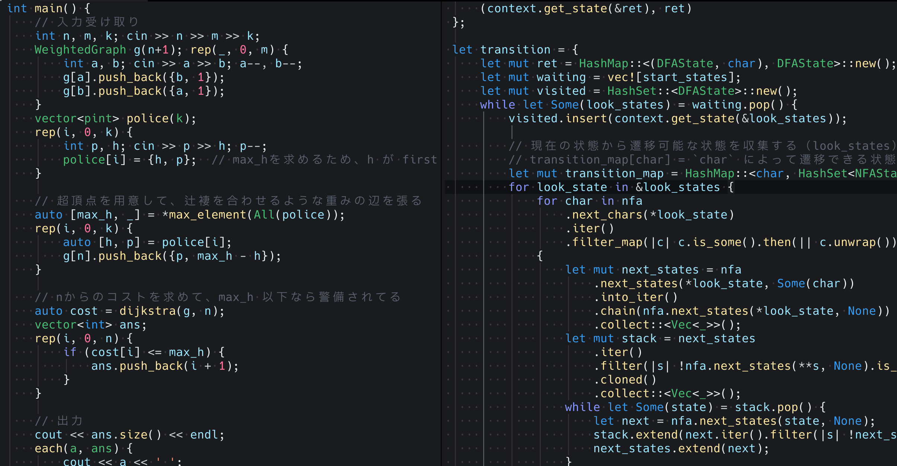
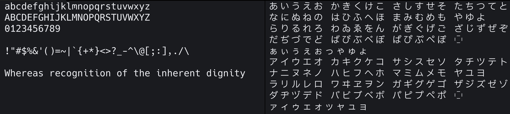
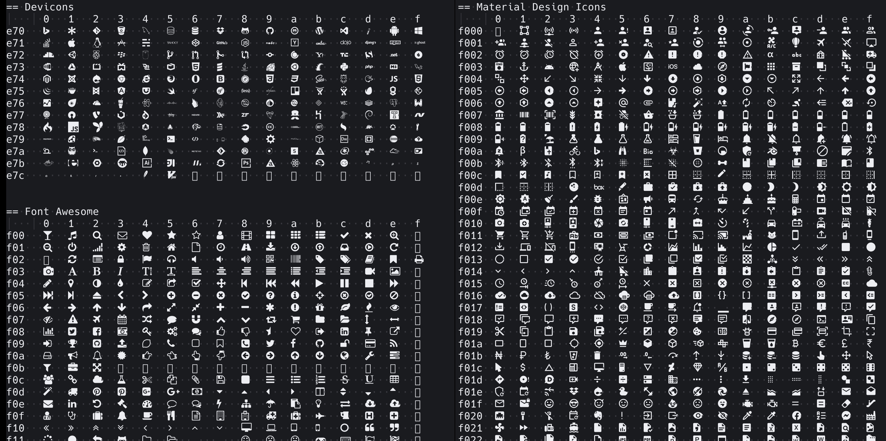
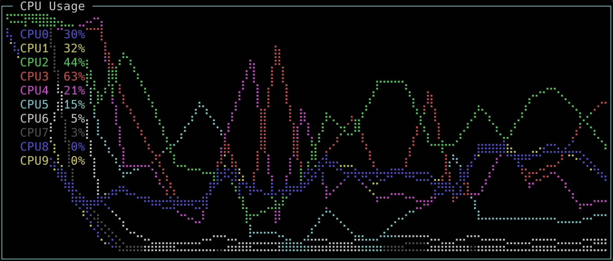

# PleckJP

> [Hack](https://sourcefoundry.org/hack/) と [IBM Plex Sans JP](https://www.ibm.com/plex/) を合成した日本語プログラミングフォント

次の4つのスタイルが用意されています。

- PleckJP-Regular
- PleckJP-Bold
- PleckJP-Italic
- PleckJP-BoldItalic

全てのスタイルで [Nerd Fonts](https://www.nerdfonts.com/) も合成されています。

## ダウンロード

[Release](https://github.com/ryota2357/PleckJP/releases) から zip ファイルがダウンロードできます。  
最新バージョンの zip ファイルの SHA256 checksum は `build/PleckJP_v*.sha256` にて確認ができます。

Homebrew (Mac) の場合は次のコマンドからもダウンロード可能です。

```
brew tap ryota2357/pleck-jp
brew install pleck-jp
```

## スクリーンショット









## ビルド

docker と docker-compose が必要です。

次のコマンドで docker を用いてビルドを行います。

```
make
```

ローカルに fontforge と python3 (fontforge への PYTHONPATH が通ってる) の環境がある場合は次のコマンドでもビルドできます。

```
make generate
```

## ライセンス

- フォントの合成スクリプトは MIT License にてライセンスされています。
- 合成元のフォントデータなどは別のライセンスが適用されています。
- 詳しくは [LICENSE](LICENSE)を確認してください。
